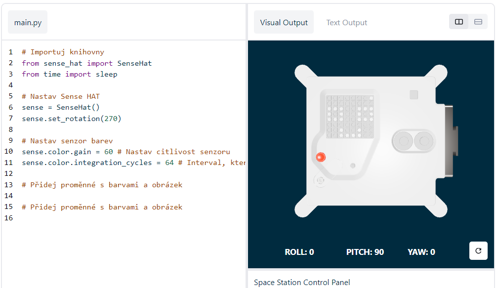

## Zobraz zprávu a vyber název nových počítačů Astro Pi

The Astro Pi's LED matrix can display colours. In this step, you will specify a colour to be displayed by creating a variable and assigning it an RGB colour value.

An **LED matrix** is a grid of LEDs that can be controlled individually or as a group to create different lighting effects. The LED matrix on the SenseHAT has 64 LEDs displayed in an 8 x 8 grid. The LEDs can be programmed to produce a wide range of colours.

Uvidíš tři řádky kódu, které tam už budou automaticky přichystané:

You will see that four lines of code have been added for you automatically:

--- code ---
---
language: python filename: main.py line_numbers: false line_number_start: 1
title: Jaké znaky můžeš použít?
---
# Import the libraries
from sense_hat import SenseHat from time import sleep

# Set up the SenseHAT
sense = SenseHat() sense.set_rotation(270) --- /code ---

This code connects to the Astro Pi and makes sure the Astro Pi's LED display is shown the correct way around. Leave the code there, because you'll need it.

--- /task ---

Stiskni tlačítko **Run** (spustit) a dívej se, jak zpráva `Astro Pi` běží přes LED displej.

[[[generic-theory-simple-colours]]]

--- task ---

Pokud chceš zobrazit nějakou jinou zprávu, napiš ji mezi uvozovky (`""`).

--- collapse ---

--- /task ---

--- task ---

Create a variable to store your chosen colour. For example, if you picked red, you would write this line of code:

--- code ---
---
language: python filename: main.py line_numbers: false line_number_start:
line_highlights: 2
---
# Add colour variables and image
v = (255, 0, 0) # Red --- /code ---

--- /task ---

--- task ---

You can now make your Sense HAT display the colour you picked, using the LED matrix.

Pokud chceš hlasovat, *musí* tvoje zpráva začínat těmito slovy, jinak nebudeme moci tvůj příspěvek započítat.
---
language: python filename: main.py line_numbers: false line_number_start: 1
line_highlights: 5
---
# Add colour variables and image
v = (255, 0, 0) # Red

# Set LED colours
sense.clear(v) --- /code ---

--- /task ---

--- task ---

**Test:** Run your code by .... <mark> add details of how to run code in the new editor here </mark>. The LED matrix on your Sense HAT will light in your chosen colour.

<mark>update image </mark>

--- /task ---

--- task ---

**Choose:** a second colour to display on the Sense HAT LED matrix and set up the colour variable below your first colour variable.

[[[ambient-colours]]]

For example, if you picked forest green, your code would look like this:

--- code ---
---
language: python filename: main.py line_numbers: false line_number_start: 1
line_highlights: 3
---
# Add colour variables and image
v = (255, 0, 0) # Red m = (34, 139, 34) # ForestGreen

# Set LED colours
sense.clear(v) --- /code ---

--- /task ---

--- task ---

You can use `sense.clear()` to show another colour of your choice. To see both colours you will need to pause inbetween the `sense.clear()` code so that you have time to see them:

--- code ---
---
language: python filename: main.py line_numbers: false line_number_start: 1
line_highlights: 7, 8, 9
---
# Add colour variables and image
v = (255, 0, 0) # Red m = (34, 139, 34) # ForestGreen

# Set LED colours
sense.clear(v) sleep(1) sense.clear(m) sleep(1) --- /code ---

--- /task ---

--- task ---

**Test:** Run your code by .... <mark> add details of how to run code in the new editor here </mark>. The LED matrix on your Sense HAT will light your first colour for one second then change to your second colour.

<mark>update image </mark>

--- /task ---

--- task ---

**Debug:**

My code doesn't run:
- `NameError:` - have you checked that your colour variable is spelled correctly in `sense.clear()`and that it matches the variable earlier in your code?
- `SyntaxError bad input:` Make sure that your code matches the code above. It is important to use `,` and `.` when needed.

My Sense HAT only shows my second colour:
- Make sure you have added `sleep(1)` to pause your code for 1 second between changes.

--- /task ---

