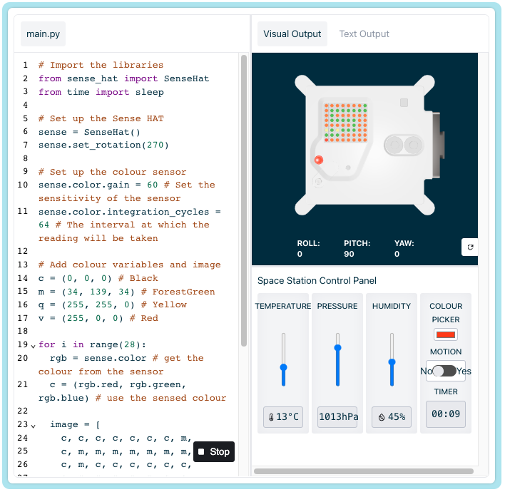

## O que é um Astro Pi?

Um Astro Pi é um computador Raspberry Pi envolto em uma caixa especialmente projetada para as condições do espaço. Inclui também tem uma placa de expansão chamada Sense HAT, criada especificamente para a missão Astro Pi. The Sense HAT has a joystick; an LED display; and sensors for recording the lighting conditions, temperature, humidity, pressure, colour, and orientation.

Aqui está uma unidade Mark I Astro Pi original na Estação Espacial Internacional, executando alguns códigos escritos por alunos. O seu código será eventualmente executado numa nova versão dos computadores Astro Pi!

<iframe width="560" height="315" src="https://www.youtube.com/embed/4ykbAJeGPMM" frameborder="0" allow="accelerometer; autoplay; encrypted-media; gyroscope; picture-in-picture" allowfullscreen></iframe>>

Para esta missão, vai usar o emulador Sense HAT. O emulador é um software que simula todas as funções do Astro Pi no seu navegador de Internet.
<mark>change screenshot of emulator</mark> 

Existem algumas diferenças entre o Sense HAT real e o emulado:
- No emulador, tu mesmo podes definir cor da luz, a temperatura, a pressão e a humidade, usando os controlos de deslize, enquanto o verdadeiro Sense HAT no Astro Pi usa sensores para medir esses parâmetros no seu ambiente.

- Podes usar o rato para clicar e arrastar o Sense HAT emulado para movê-lo e rodá-lo, simulando mudanças na sua orientação; o verdadeiro Astro Pi (e o seu Sense HAT) pode mover-se no mundo real, e os sensores de orientação do Sense HAT detetam quando e como se moveu.
